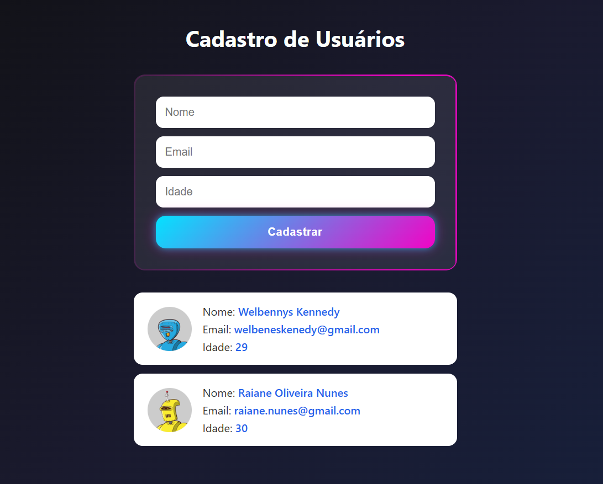

# Cadastro de Usuários

Aplicação web feita com **React + Vite** para cadastro rápido de usuários.

A interface segue o estilo da imagem de referência: fundo escuro, formulário com borda neon animada, botão com gradiente azul/rosa e lista de cards com avatar gerado automaticamente.

## Deploy

- Aplicação online: https://welbennyskennedy.github.io/Cadastro-de-usuario/

## Preview



## Funcionalidades

- Cadastro de usuário com **nome**, **email** e **idade**
- Exibição dos usuários cadastrados em cards
- Avatar automático usando `https://robohash.org/{nome}`
- Campos limpos automaticamente após o envio
- Layout moderno com destaque visual (efeito neon + gradiente)

## Tecnologias

- React 19
- Vite 7
- CSS puro (sem framework)
- ESLint

## Como executar o projeto

### Pré-requisitos

- Node.js 18+ (recomendado Node 20+)
- npm

### Passos

```bash
npm install
npm run dev
```

Depois, abra o endereço exibido no terminal (normalmente `http://localhost:5173`).

## Scripts disponíveis

- `npm run dev` — inicia o servidor de desenvolvimento
- `npm run build` — gera build de produção
- `npm run preview` — visualiza o build localmente
- `npm run lint` — executa validação com ESLint

## Estrutura principal

```text
cadastro-usuarios/
├─ src/
│  ├─ App.jsx
│  ├─ App.css
│  └─ components/
│     ├─ UserCard.jsx
│     └─ UserCard.css
├─ index.html
└─ package.json
```

## Melhorias futuras (opcional)

- Persistência dos usuários em `localStorage`
- Validação de formulário mais robusta
- Edição e remoção de usuários
